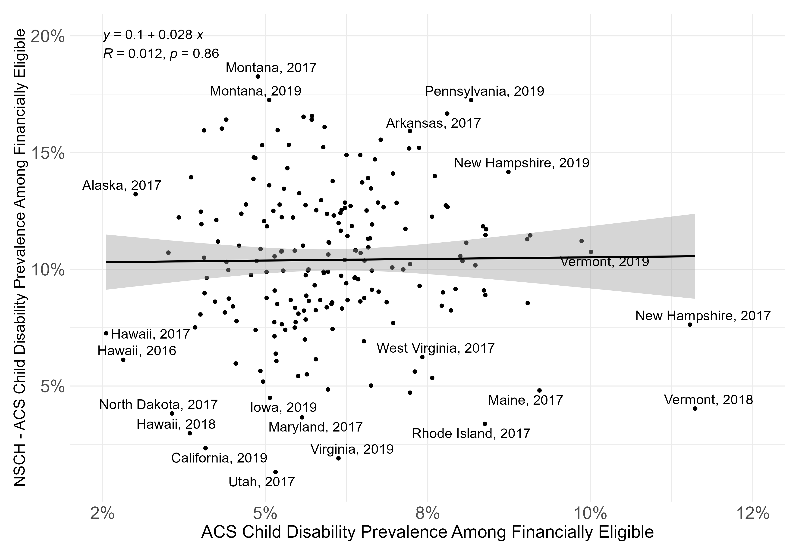
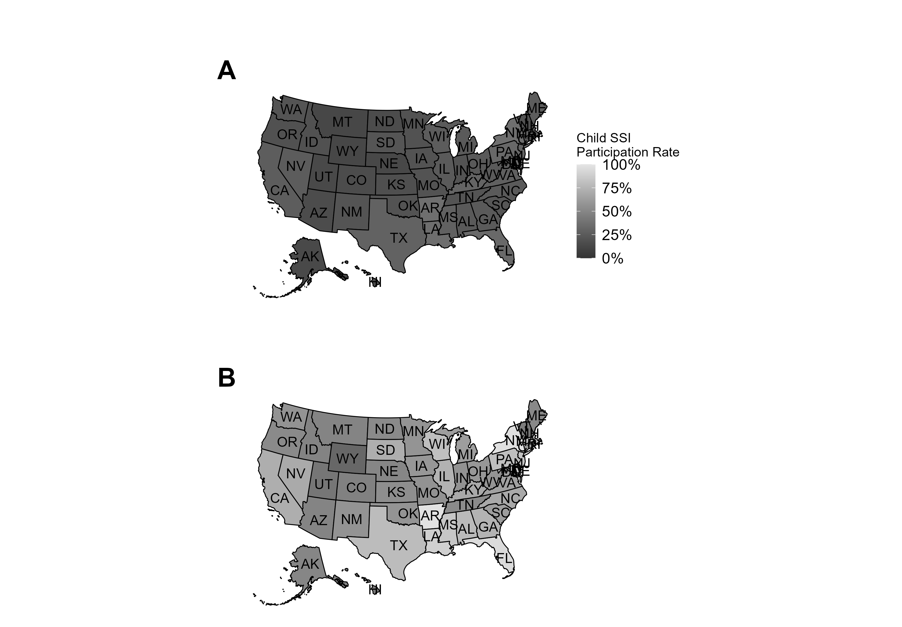
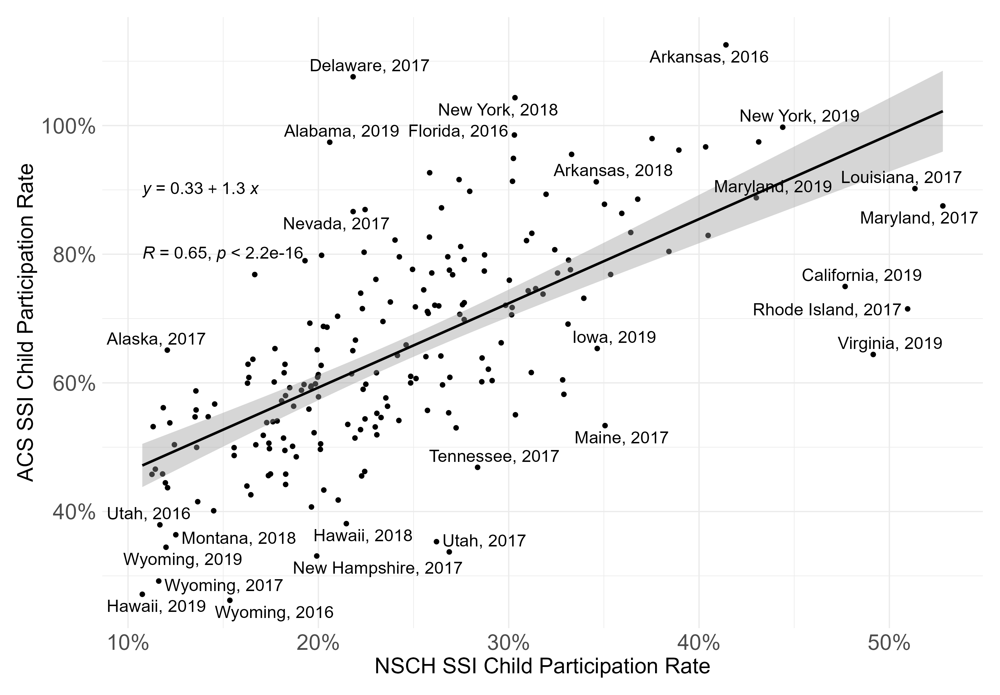

# Child Supplemental Security Income (SSI) Program Participation Estimation

This repository contains mostly R files that are used to generate tables and figures for `manuscript_method.docx`. The downloaded SSA data is stored as CSVs in `data/raw/ssa/recipients/`, while ACS and NSCH are loaded in through `tidycensus` API and a scraper leveraging the `rvest` packages and eventually saved in `data/raw/acs/` and `data/raw/nsch/`, respectively. Functions for all of these data imports are found in `scripts/01_functions.R`.

## Directory Tree

```
.
├── data
│   ├── processed
│   │   └── ...
│   └── raw
│       ├── acs
│       │   ├── acs.csv
│       │   └── acs_raw.csv
│       ├── nsch
│       │   └── nsch.csv
│       └── ssa
│           ├── payments
│           │   └── ...
│           ├── payments-direct
│           │   └── ...
│           └── recipients
│               └── ...
├── manuscript
│   ├── 2022
│   │   ├── manuscript.docx
│   │   ├── manuscript_mld.docx
│   │   ├── manuscript_mld_jk_intro_only.docx
│   │   ├── references.bib
│   │   ├── references.csv
│   │   └── references.xml
│   └── 2023
│       ├── 01_method
│       │   └── manuscript_method.docx
│       └── 02_application
│           └── manuscript_application.docx
├── README.md
├── results
│   ├── 01_method
│   │   ├── disprev-diff.png
│   │   ├── disprev.csv
│   │   ├── ssi.csv
│   │   ├── ssi.png
│   │   └── usa-heatmap.png
│   └── 02_application
├── scripts
│   ├── 01_functions.R
│   ├── 02_data-processing.R
│   ├── 03_results_method.R
│   └── 04_results_application.R
└── ssi.Rproj
```

## Directory Details

-   `data/`: 
    -   `processed/`: Contains saved RDS files that are used for `03_results_method.R` so that `02_data-processing.R` can be bypassed if no updates to the raw data have been made.
    -   `raw/`: Contains downloaded SSA data on payments and counts of recipients.
        -   `acs/`
            -   `acs_original.csv`: CSV for ACS data that contains 10%, 50%, and 90% percentiles of disability and total counts by FPL level.
            -   `acs.csv`: Contains CSV for ACS data that just focused on 50% percentile of disability and total counts by FPL level.
        -   `nsch/`: 
            -   `nsch.csv`: CSV for NSCH data that has been scraped and aggregated together.
        -   `ssa/`
            -   `payments/`: (Ignore for this analysis.)
            -   `payments-direct/`: (Ignore for this analysis.)
            -   `recipients/`: Contains CSVs for 2016-2020 for counts of SSA recipients.
-   `manuscript/`:
    -   `2022/`: Contains original draft of one large manuscript with commented files and reference files in different formats.
    -   `2023/`:
        -   `01_method/`: Contains proposed first manuscript on just the methodology. (Andrew)
        -   `02_application/`: Contains proposed second manuscript on applications of the methodology. (Kai)
-   `results/`:
    -   `01_method/`: Contains CSVs and PNGs for tables and figures that are proposed to be put in the first manuscript.
        -   `disprev-diff.png`: Proposed Figure 1 for Manuscript 1.
        -   `disprev.csv`: Proposed Table 1 for Manuscript 1.
        -   `ssi.csv`: Proposed Table 2 for Manuscript 1.
        -   `ssi.png`: Proposed Supplementary Figure 1 for Manuscript 1.
        -   `usa-heatmap.png`: Proposed Figure 2 for Manuscript 1.
    -   **(To be updated)** `02_application/`: 
-   `scripts/`: 
    -   `01_functions.R`: Contains functions that read in and transform data from SSA, ACS, and NSCH.
    -   `02_data-processing.R`: Contains code to further process raw data into forms that are almost ready for table and figure form.
    -   `03_results_method.R`: Contains code to generate raw tables and figures from processed data.
    -   **(To be updated)** `04_results_application.R`: 

## Figures for Methods Manuscript

Proposed Figure 1 for Manuscript 1:



Proposed Figure 2 for Manuscript 1:



Proposed Supplementary Figure 1 for Manuscript 1:


