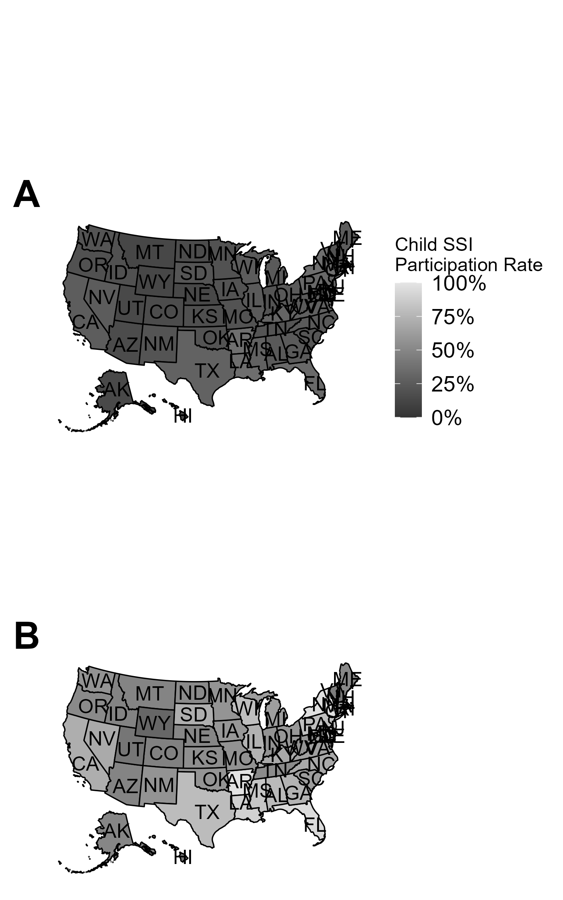
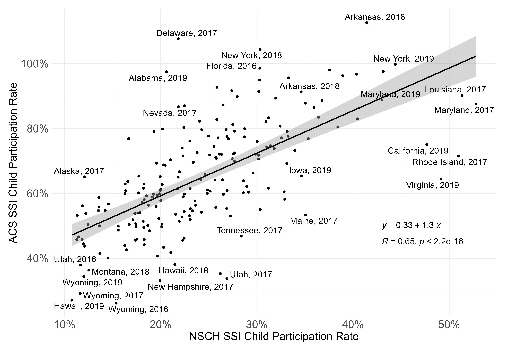

# Supplemental Security Income Program Child Participation Estimation

This repository contains mostly R files that are used to generate tables and figures `manuscript_method.docx`. The downloaded SSA data is stored as CSVs in `data\raw\ssa\recipients`, while ACS and NSCH are loaded in through `tidycensus` API and a scraper leveraging the `rvest` packages. Functions for all of these data imports are found in `scripts\01_functions.R`.

## Directory Tree

```
.
├── data
│   ├── processed
│   │   └── ...
│   └── raw
│       └── ssa
│           ├── payments
│           │   └── ...
│           ├── payments-direct
│           │   └── ...
│           └── recipients
│               └── ...
├── manuscript
│   ├── 2022
│   │   ├── manuscript.docx
│   │   ├── manuscript_mld.docx
│   │   └── manuscript_mld_jk_intro_only.docx
│   └── 2023
│       ├── 01_method
│       │   └── manuscript_method.docx
│       └── 02_application
│           └── manuscript_application.docx
├── README.md
├── results
│   ├── 01_method
│   │   ├── disprev-diff.png
│   │   ├── disprev.csv
│   │   ├── ssi.csv
│   │   ├── ssi.png
│   │   └── usa-heatmap.png
│   └── 02_application
├── scripts
│   ├── 01_functions.R
│   ├── 02_data-processing.R
│   ├── 03_results_method.R
│   └── 04_results_application.R
└── ssi.Rproj
```

## Directory Details

-   `data/`: 
    -   `processed/`: Contains intermediate output that is used for `03_results_method.R`.
    -   `raw/`: Contains downloaded SSA data on payments and counts of recipients.
        -   `ssa/`
-   `manuscript/`:
    -   `2022/`: Contains original draft of one large manuscript with commented files.
    -   `2023/`: Contains original draft of one large manuscript with commented files.
        -   `01_method/`: Proposed first manuscript on just the methodology. (Andrew)
        -   `02_application/`: Proposed second manuscript on applications of the methodology. (Kai)
-   `results/`:
    -   `01_method/`: Contains CSVs and PNGs for tables and figures that are proposed to be put in the first manuscript.
    -   **(To be updated)** `02_application/`: 
-   `scripts/`: 
    -   `01_functions.R`: Contains functions that read in and transform data from SSA, ACS, and NSCH.
    -   `02_data-processing.R`: Contains code to further process raw data into forms that are almost ready for table and figure form.
    -   `03_results_method.R`: Contains code to generate raw tables and figures from processed data.
    -   **(To be updated)** `04_results_application.R`: 
## Figures for Methods Manuscript





